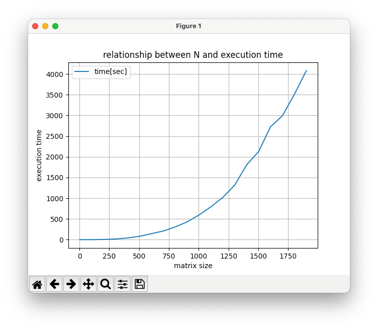

# STEP week2

---

### 宿題1　matrix.py
> 行列積を求めるプログラムを書いて、行列のサイズNと実行時間の関係を調べる
##### アルゴリズム
2重のfor文で行列Aのi行目と行列Bのj列目を取り出し、それぞれの要素を足したものを行列Cのi行j列目に代入し、行列Cを返すことで行列積を求めた。

また、Nと実行時間の関係をグラフにするためにmatplotlibを用いた。グラフを描写するために、for文で2からNまで100刻みで行列積の計算をし、それぞれのNと時間をリストに保存するようにコードを変更した。

##### Nと実行時間の関係
```bash
$ python3 matrix.py 2000
2 time: 0.000027 sec
102 time: 0.712463 sec
202 time: 4.777727 sec
302 time: 16.087600 sec
402 time: 39.981814 sec
502 time: 80.114567 sec
602 time: 143.313572 sec
702 time: 207.530272 sec
802 time: 306.596190 sec
902 time: 428.547470 sec
1002 time: 595.036556 sec
1102 time: 793.275441 sec
1202 time: 1019.842172 sec
1302 time: 1319.926621 sec
1402 time: 1807.228800 sec
1502 time: 2128.559682 sec
1602 time: 2726.067277 sec
1702 time: 2995.377013 sec
1802 time: 3511.571172 sec
1902 time: 4082.007583 sec
```
グラフは以下のようになった。


##### 考察
このアルゴリズムはfor文が3重になっているため、O(n^3)である。
グラフからも、nの値が大きくなるにつれて急激に実行時間が増加していることが分かる。

---

### 宿題2
> 木構造だとO(log N)、ハッシュテーブルだとほぼO(1) で検索・追加・削除を実現できる。
これだけ見ればハッシュテーブルのほうがはるかに優れているように見える。ところが、現実の大規模なデータベースでは、ハッシュテーブルではなく木構造が使われることが多い。その理由を考えよ。

##### 考察
* データ数の上限が分かっていないとき、木構造はどんなにデータの数が大きくなっても木の葉を増やせばよいが、ハッシュテーブルは多段ハッシュテーブル、再ハッシュする必要がある。多段ハッシュテーブルの場合は何回も繰り返すうちに乱雑になってしまうし、再ハッシュには時間がかかるから
* ハッシュ関数を作る際に、なるべく重ならないような工夫を加えなければならず、その工夫が難しいから
* 衝突するときの対策として、ハッシュテーブルにデータのリストを入れるようにするが、リストは線形探索しなければならないため、何回も衝突してしまった場合は時間がかかるから
* O(log N)の木構造とほぼO(1)のハッシュテーブルを比較したとき、O(log N)も比較的高速であり、コードも分かりやすいから
* 木構造の場合はデータ数分だけメモリを使用するが、ハッシュテーブルの場合は予想されるデータ数分以上の多くのメモリを用意する必要があるため
* ハッシュテーブルには大小がないが、木構造なら大小関係がある


---

### 宿題3
> もっとも直近にアクセスされたページ上位X個をキャッシュしておく というキャッシュの管理をほぼO(1)で実現できるデータ構造を考えよ。

> 次の操作をほぼO(1)で実現するデータ構造を考えよう
* 与えられた<URL, Webページ>があるかないかを検索する
* もしない場合、キャッシュ内で一番古い<URL, Webページ>を捨てて、かわりに与えられた<URL, Webページ>を追加する

##### 考察
ハッシュテーブルだけだと順序を管理できないので、ハッシュテーブルと双方向連結リストを組み合わせて、X個の<URL, Webページ>をアクセスされた順に取り出せるようにする。


双方向連結リストは、先頭への追加はO(1)、任意の場所への追加、あるノードの削除もO(1)である。
任意の場所への追加について、任意の場所へアクセスするのに通常はリストを前から見ていくのでO(n)だが、今回はハッシュテーブルと組み合わせているため、ハッシュ関数によってほぼO(1)でアクセスできる。

もし新たなページがアクセスされたら、最後尾の削除(O(1))を行い、先頭に新たなページのハッシュテーブルをつなげる。キャッシュに存在するページが再度アクセスされたら、キャッシュに存在するデータのノードをつけかえて削除(O(1))し、先頭につけかえる。

このようにすることで順序を管理したハッシュテーブルができるのではないかと考えた。
