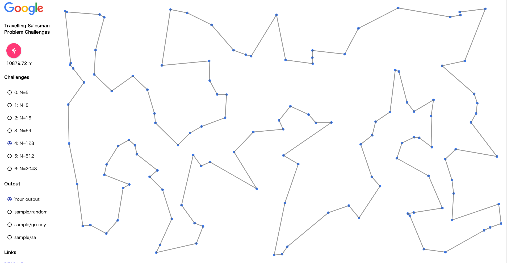

# STEP week5

---

### 宿題　solver.py, (solver_for_5.py)
> TSPをどれだけよりよいものにできるか？

### アルゴリズム
**greedy Algrithm で求めた経路のうち、適当な2つの辺を選んでそれらを入れ替えていくというのを最も小さい距離になるまで繰り返す。**...①

スタートする点を1つずつ変えて①を繰り返していく。このようにして得られた経路のうち、最も総距離が短いものをTSPの答えとする。

### 実行結果
例) `$ python3 solver.py input_4.csv output_4.csv`

### コメント
本当は上で説明したアルゴリズムでinput_0.csv〜input_6.csvの最短経路を求めたかったのですが、input_5.csvとinput_6.csvのあたりから実行時間がかなりかかってしまうためできませんでした。

なので、
* input_5.csv : greedy Algrithm ではどのcityから始めたときに最短距離になるかを調べて、そのcityからスタートしたときの経路に対して2-optを行う
* input_6.csv : solver_greedy.py

で最短経路を求めました。

今回の宿題を通して、NP-Hardは解くのが難しいことがとてもよく分かりました。
